## Índice

1. [📝 Introducción](#Introducción)
2. [💪 Motivación del Proyecto](#Motivación_El_Proyecto)
3. [📚 Conjunto de Datos](#Conjunto_De_Datos)
4. [🛠 Implementación](#Implementación)
5. [💬 Extracción del texto de los documentos](#Extracción_Del_Texto_De_Los_Documentos)
6. [🕵️‍♀️ Detección de las menciones personales](#Detección_De_Las_Menciones_Personales)
7. [😶‍🌫️ Anonimización de las menciones](#Anonimización_De_Las_Menciones)
8. [🔗 Generación de reemplazos mediante Grafos](#Generación_De_Reemplazos_Mediante_Grafos)
9. [📕 Generación de reemplazos mediante Diccionarios](#Generación_De_Reemplazos_Mediante_Diccionarios)
10. [🟰 Normalización de las menciones](#Normalización_De_Las_Menciones)
11. [📄 Generación del nuevo documento PDF](#Generación_Del_Nuevo_Documento_Pdf)
12. [🧰 Rendimiento de la Herramienta](#Rendimiento_De_La_Herramienta)
13. [⚖️ Evaluación del Rendimiento](#Evaluación_Del_Rendimiento)
14. [⚙️ Estructura del Repositorio](#Estructura_Del_Repositorio)
15. [📷 Capturas de Pantalla](#Capturas)
16. [🔚 Conclusiones y Trabajo Futuro](#Conclusiones_Y_Trabajo_Futuro)
17. [🔚 Conclusiones](#Conclusiones)
18. [🔮 Trabajo Futuro](#Trabajo_Futuro)


Repositorio del proyecto fin de máster: **Implementación de una herramienta basada en PLN para la detección y anonimización de datos personales en documentos**. Link a la web con la memoria oficial: [UVaDoc](https://uvadoc.uva.es/handle/10324/49995)

# 📝 Introducción <a name="Introducción"></a>

En los últimos años, el avance en el campo del Aprendizaje Automático, unido a las mejoras hardware, y al aumento de datos, ha motivado la utilización de técnicas de aprendizaje para automatizar procesos o extraer conocimiento a partir de los datos (Ver Figura 1).

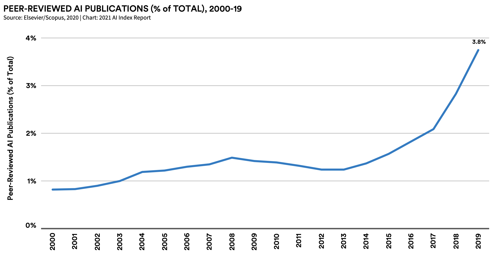
**Figura 1: Evolución de las revisiones de artículos de Inteligencia Artificial. Fuente: [AI Index Report](https://aiindex.stanford.edu/wp-content/uploads/2021/03/2021-AI-Index-Report\_Master.pdf)**

Desde el punto de vista del Procesamiento del Lenguaje Natural (PLN), la utilización de estos datos se encuentra más limitada debido a la información de carácter personal en los datos.

Esta característica, unida a la fuerte legislación que existe actualmente sobre la Protección de Datos (RGPD), hace que las administraciones hayan de tener un mayor control y cuidado a la hora de utilizar y/o compartir documentos con información personal.

Sin embargo, existen técnicas para evitar estos problemas:
* Eliminar las apariciones de las menciones personales.
* **Anonimización de las menciones.**

## 💪 Motivación del proyecto <a name="Motivación_El_Proyecto"></a>

Debido a ese control y privacidad sobre los datos, una pérdida en los mismos podría suponer grandes sanciones, además del problema que supone el filtrado de datos personales.

En este proyecto se va a presentar una propuesta **genérica**, que permita tanto detectar distintos tipos de menciones personales en los datos, así como anonimizarlas.

Además, la propuesta presentada abordará todas las etapas a la hora de anonimizar un documento:

* Obtención del texto del documento origen --> Aplicando técnicas de OCR.
* Detección de las menciones personales --> Utilizando modelos de Deep Learning para PLN.
* Anonimización de las menciones --> Implementando mecanismos de reemplazos eficientes.
* Generación del nuevo documento anonimizado --> Creando y modificando archivos PDF.

# 📚 Conjunto de Datos <a name="Conjunto_De_Datos"></a>

El conjunto de datos se encuentra formado por 309 documentos administrativos de distintas clases: multas, permisos, pagos, etc (Ver Figuras 2 y 3).

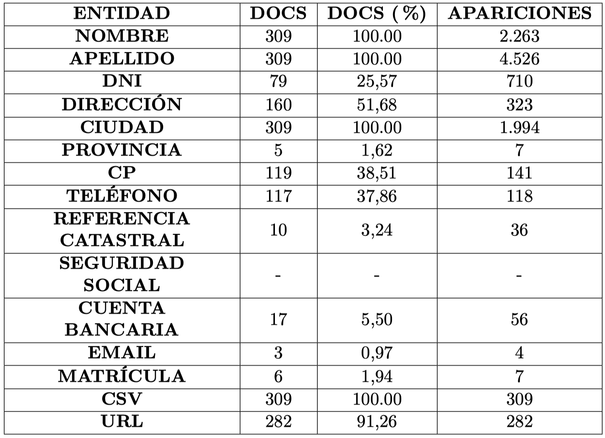
**Figura 2: Distribución de las entidades en los documentos.**

**Figura 3: Estructura de los documentos.**

# 🛠 Implementación <a name="Implementación"></a>

El *pipeline* desarrollado se encuentra formado por los siguientes componentes (Ver Figura 4):
* Extracción de Texto.
* Detección de menciones personales.
* Anonimización.
* Normalización de las menciones.
* Generador de PDF.

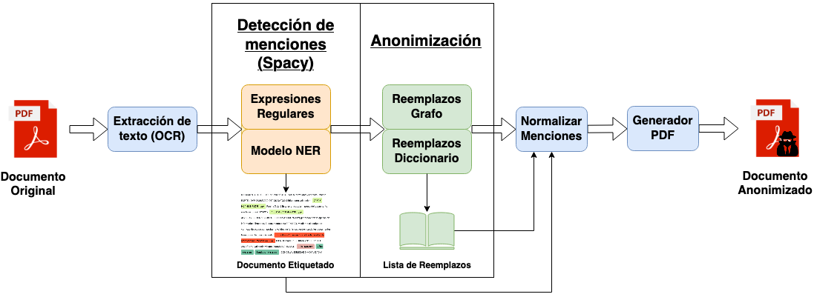
**Figura 4: Estructura del pipeline desarrollado.**

## 💬 Extracción del texto de los documentos <a name="Extracción_Del_Texto_De_Los_Documentos"></a>

Este componente se encarga de obtener el texto del documento PDF de entrada (Ver Figura 5).

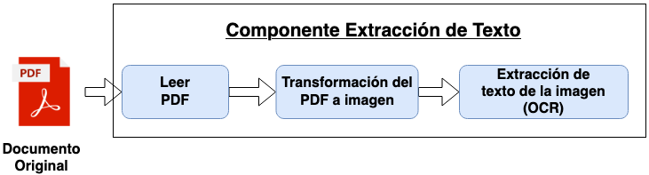
**Figura 5: Flujo de ejecución del componente de extracción de texto.**

## 🕵️‍♀️ Detección de las menciones personales <a name="Detección_De_Las_Menciones_Personales"></a>
Componente encargado de extraer las menciones personales del texto. Las menciones son detectadas utilizando modelos de Deep Learning generados utilizando la librería de PLN [Spacy](https://spacy.io/).

Además, se ha implementado un componente de soporte basado en expresiones regulares para detectar menciones con una estructura predecible (Ver Figuras 6 y 7).

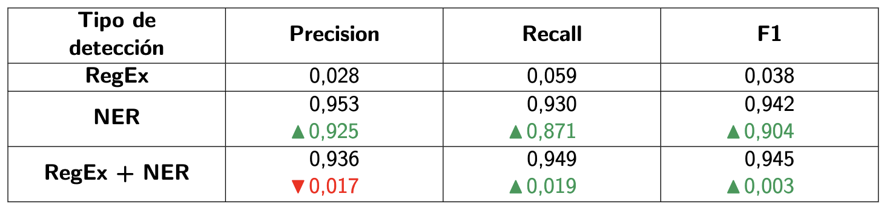
**Figura 6: Métricas generales de la herramienta con y sin la aplicación expresiones regulares.**

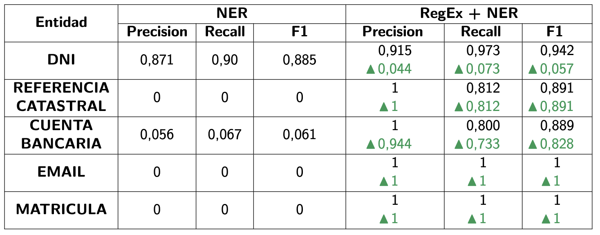
**Figura 6: Métricas de la herramienta desglosadas por entidad con y sin la aplicación expresiones regulares.**

## 😶‍🌫️ Anonimización de las menciones <a name="Anonimización_De_Las_Menciones"></a>

El componente de anonimización se ha desarrollado siguiendo un enfoque híbrido basado en grafos y diccionarios:
* **Enfoque Basado en Grafos:** Permite generar reemplazos para los tipos de menciones que guardan relación entre sí (provincia, ciudad y código postal).
* **Enfoque Basado en Diccionarios:** Permite generar reemplazos para el resto de las entidades.

Alguna de las propiedades que cumplen los nuevos reemplazos son:
* **Robustez** --> Se generan reemplazos para cualquier tipo de mención.
* **Integridad** --> Mantienen la estructura y tipo del original.
* **Concordancia** --> Los nuevos reemplazos mantienen relaciones entre sí.

### 🔗 Generación de Reemplazos Mediante Grafos <a name="Generación_De_Reemplazos_Mediante_Grafos"></a>

Permite generar reemplazos entre distintos tipos de entidades manteniendo su jerarquía (Ver Figura 8). La jerarquía implementada es **Provincia > Ciudad > Código Postal**.

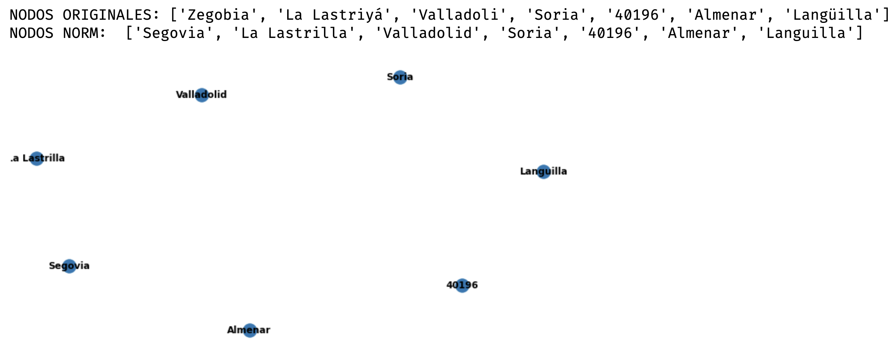

**Figura 8: Generación de reemplazos mediante grafos.**

### 📕 Generación de Reemplazos Mediante Diccionarios <a name="Generación_De_Reemplazos_Mediante_Diccionarios"></a>

Permite generar reemplazos para el resto de las entidades manteniendo su estructura (Ver Figura 9).

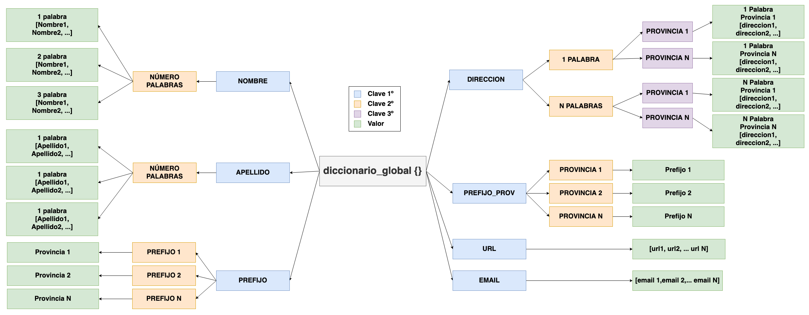
**Figura 9: Estructura del diccionario de reemplazos.**

## 🟰 Normalización de las  Menciones <a name="Normalización_De_Las_Menciones"></a>

Algunos tipos de documentos tienen partes cuyo texto se escribe todo en mayúsculas o en minúsculas. Para evitar que sea evidente que el documento ha sido modificado, se normalizan los reemplazos para que estos tengan el formato de la mención original: todo mayúsculas, todo minúsculas, etc.

## 📄 Generación del nuevo documento PDF <a name="Generación_Del_Nuevo_Documento_Pdf"></a>

Este componente se encarga de tomar el texto del documento original, y de generar un nuevo documento PDF con dicho texto y reemplazando las menciones por sus reemplazos normalizados (Ver Figura 10).

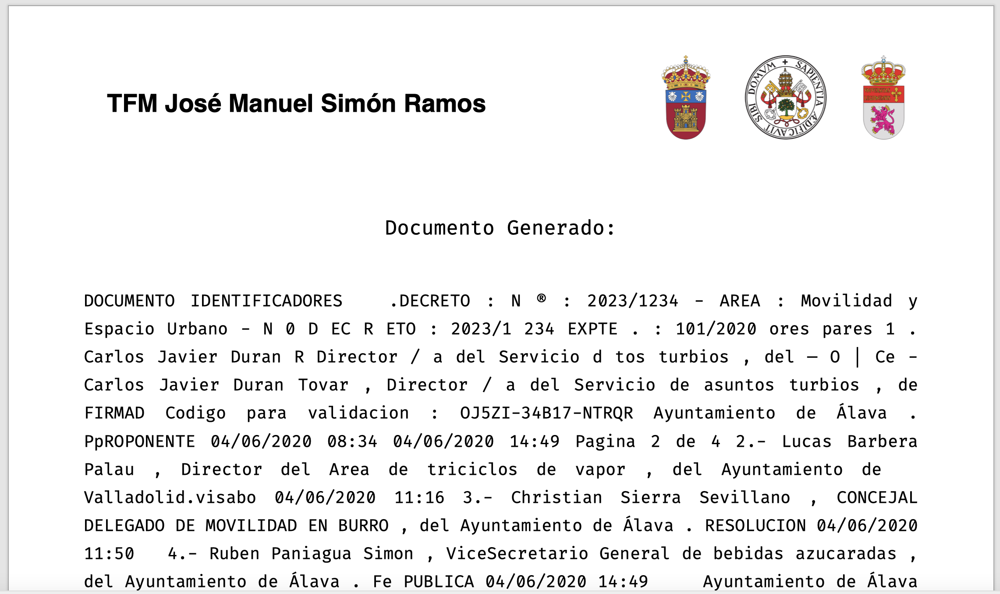
**Figura 10: Documento final generado por la herramienta.**

# 🧰 Rendimiento de la herramienta <a name="Rendimiento_De_La_Herramienta"></a>
## ⚖️ Evaluación del rendimiento <a name="Evaluación_Del_Rendimiento"></a>
Tras la realización de varias pruebas con distintos documentos de diferente tamaño, número de páginas, menciones, palabras, etc, los resultados (en términos de rendimiento) obtenidos son los siguientes:

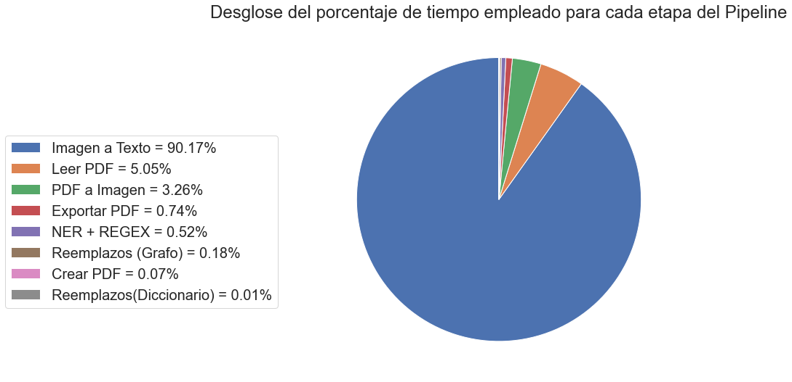
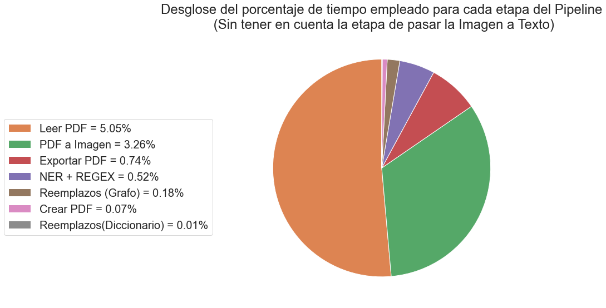
**Figura 11: Rendimiento de la herramienta por componentes.**

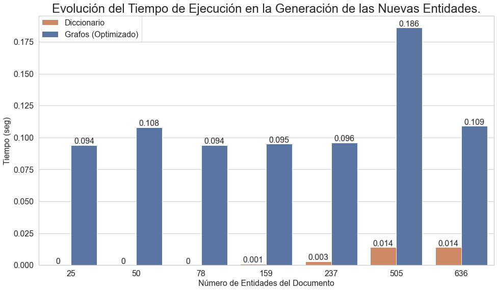
**Figura 12: Rendimiento de la herramienta a la hora de realizar la generación de los reemplazos.**

# ⚙️ Estructura del Repositorio <a name="Estructura_Del_Repositorio"></a>

El repositorio se encuentra estructurado de la siguiente forma:

```
.
├── app/ # Herramienta software
│   ├── datos/ # Datos para generar el grafo y el diccionario
│   ├── doc/ # Directorio donde se almacenan los documentos en raw para la herramienta
│   ├── keys/ # Claves para generar el certificado digital de la herramienta
│   ├── models/ # Modelo de PLN de la herramienta
│   ├── output/ # Directorio donde se almacenan los documentos finales procesados en la herramienta
│   ├── src/ # Código fuente de las distintas componentes de la herramienta
│   ├── static/ # Elementos estáticos de la herramienta (logo, css, imgs, etc)
│   ├── templates/ # Páginas html de la herramienta
│   ├── tmp/ # Directorio donde se almacenan los documentos temporales de la herramienta
│   ├── app.py # Script principal para el despliegue de la herramienta
│   ├── config.json # Configuración de la herramienta
│   └── Utils.py # Funciones comunes de los distintos módulos
├── assets/ # Imágenes del README
├── Documentacion Tecnica/ # Memoria y presentación del proyecto en PDF
├── Notebooks/ # Ficheros .ipynb adicionales
├── config.cfg # Configuración para entrenar el modelo de Spacy
├── README.md
└── requirements.txt # Dependencias python para ejecutar la herramienta
```

# 📷 Capturas de Pantalla <a name="Capturas"></a>

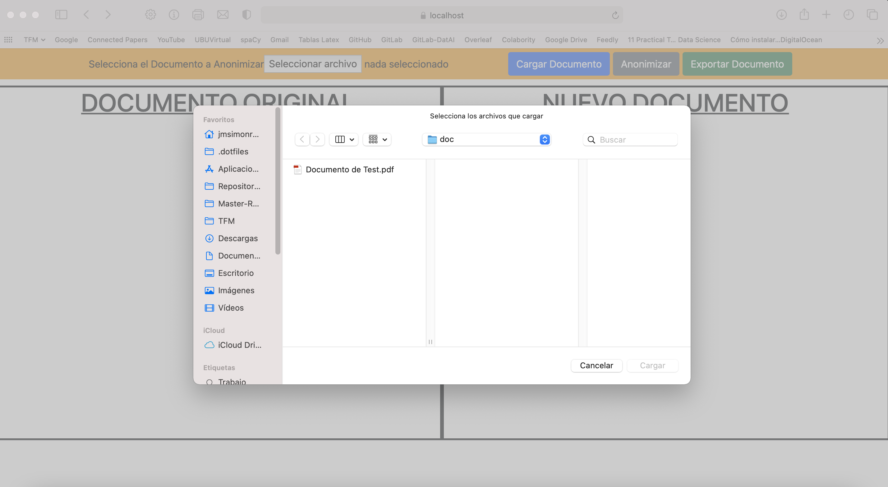
**Figura 13: Herramienta: Examinar documento a anonimizar.**

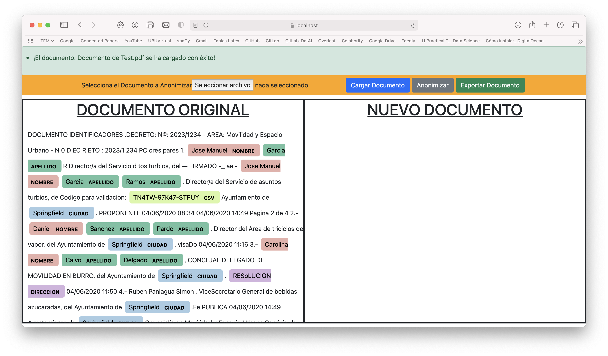
**Figura 14: Herramienta: Detectadas menciones personales en el documento.**

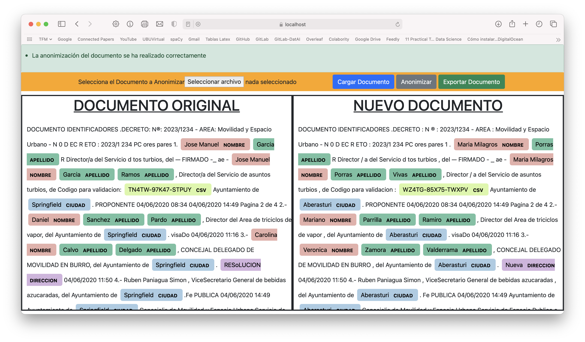
**Figura 15: Herramienta: Menciones anonimizadas.**

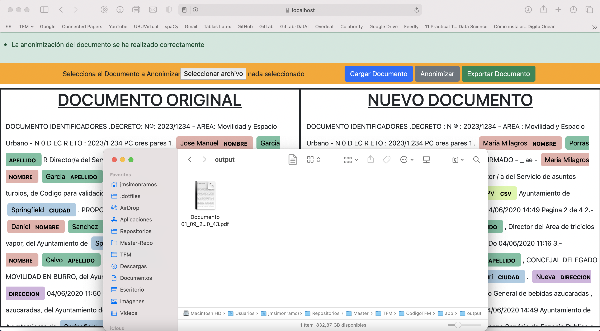
**Figura 16: Herramienta: Exportar documento anonimizado.**

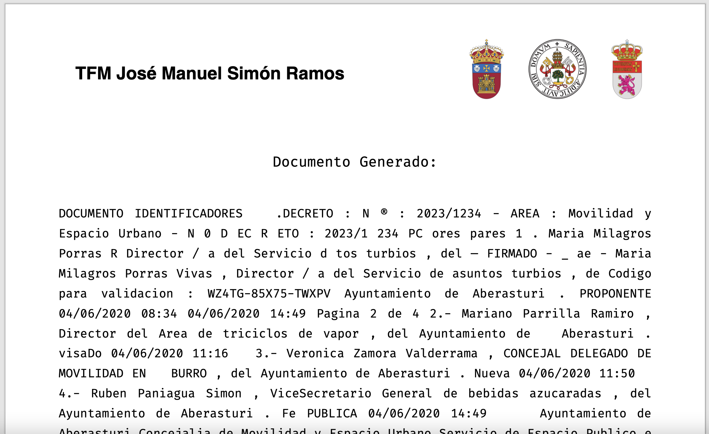
**Figura 17: Herramienta: Documento Exportado.**

# 🔚 Conclusiones y Trabajo Futuro <a name="Conclusiones_Y_Trabajo_Futuro"></a>
## 🔚 Conclusiones <a name="Conclusiones"></a>
Las conclusiones que se han obtenido tras la realización del proyecto son:

* Los resultados obtenidos durante la creación y optimización del modelo son muy buenos a pesar de la variedad de las menciones a detectar (en torno a un 94% de detección).
* La utilización de expresiones regulares ha mejorado de forma sustancial los resultados para menciones con una estructura predecible (57,59% de media).
* Los tiempos de ejecución de los componentes desarrollados en el proyecto son bajos (0,19 segundos de media para documentos entre 25 y 630 menciones, aproximadamente 240 menciones de media), y se mantienen constantes (o aumentan muy ligeramente) a medida que aumentan las palabras o las menciones: **Escalabilidad**.
* A pesar de las limitaciones de la herramienta, esta puede considerarse genérica ya que es posible adaptarla a cualquier contexto modificando el modelo o la base de conocimiento para generar los reemplazos.

## 🔮 Trabajo Futuro <a name="Trabajo_Futuro"></a>

Las posibles líneas de trabajo futuro que se abren tras la finalización del proyecto son:
* Optimización o implementación de un mecanismo eficiente de búsqueda en grafos.
* Implementación de diccionarios dinámicos para realizar los reemplazos.
* Aplicación de la herramienta a otro tipo de documentos del mismo tipo, o a los mismos documentos pero en otra administración distinta.
* Mejora de la gestión y manejo de los PDF.
* Implementación de nuevos componentes en el *pipeline* (introducción de metadatos para volver a las menciones originales, cifrado de los metadatos, etc).